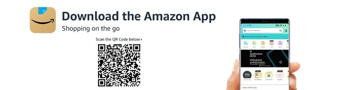

# thaliermani.github.in
Chatbot for a webpage
<html lang="en">
<head>
<title>AMAZON SERVICE</title>
<meta charset="UTF-8">
<meta name="viewport" content="width=device-width, initial-scale=1">

</head>
<body>

  <h1><b>Amazon Service</b></h1>
  <i><h4>AMAZON - India's largest online store</i><h4>
  
A <b>responsive</b> website provided for the customer.

  <a href="http://www.amazon.in/" target="blank" >Home</a>
  <a href="https://www.amazon.in/amazonpay/home?ref_=apay_logo_APayDashboard" target="blank">Amazon Pay</a>
  <a href="https://www.amazon.in/Home-Kitchen/b?ie=UTF8&node=976442031" target="blank"> Home&Kitchen </a>
  <a href="https://www.amazon.in/electronics/b?ie=UTF8&node=976419031" target="blank" >Electronics&Accessories</a>
  <a href="https://www.amazon.in/gp/goldbox" target="blank" class="right">Today's Deals</a>

  

    <h2>What We Do:</h2>
    

    
Although our business has evolved over the years, one constant is customers’ desire for lower prices, better selection,
and convenient services. Today, Amazon shoppers can find what they’re looking for online and in person. From delivering fresh 
produce to their doorstep to creating and distributing movies, music, and more, we are always finding new ways to delight our 
customers.

    <h3>What can we help you with </h3>

	<a href="https://www.amazon.in/ap/signin?_encoding=UTF8&accountStatusPolicy=P1&openid.assoc_handle=inamazon&openid.claimed_id=http%3A%2F%2Fspecs.openid.net%2Fauth%2F2.0%2Fidentifier_select&openid.identity=http%3A%2F%2Fspecs.openid.net%2Fauth%2F2.0%2Fidentifier_select&openid.mode=checkid_setup&openid.ns=http%3A%2F%2Fspecs.openid.net%2Fauth%2F2.0&openid.ns.pape=http%3A%2F%2Fspecs.openid.net%2Fextensions%2Fpape%2F1.0&openid.pape.max_auth_age=0&openid.return_to=https%3A%2F%2Fwww.amazon.in%2Fgp%2Fcss%2Forder-history%3Fie%3DUTF8%26ref_%3Dhp_ss_v3_yo_t4&pageId=webcs-yourorder&showRmrMe=1" target="blank class="active"><h4>➼  Your Order</h4></a>

	<a href="https://www.amazon.in/ap/signin?_encoding=UTF8&accountStatusPolicy=P1&openid.assoc_handle=inamazon&openid.claimed_id=http%3A%2F%2Fspecs.openid.net%2Fauth%2F2.0%2Fidentifier_select&openid.identity=http%3A%2F%2Fspecs.openid.net%2Fauth%2F2.0%2Fidentifier_select&openid.mode=checkid_setup&openid.ns=http%3A%2F%2Fspecs.openid.net%2Fauth%2F2.0&openid.ns.pape=http%3A%2F%2Fspecs.openid.net%2Fextensions%2Fpape%2F1.0&openid.pape.max_auth_age=0&openid.return_to=https%3A%2F%2Fwww.amazon.in%2Fgp%2Fcss%2Forder-history%3Fie%3DUTF8%26ref_%3Dhp_ss_v3_yo_t4&pageId=webcs-yourorder&showRmrMe=1" target="blank class="active"><h4>➼ Manage Prime</h4></a>

	<a href="https://www.amazon.in/ap/signin?_encoding=UTF8&accountStatusPolicy=P1&openid.assoc_handle=inamazon&openid.claimed_id=http%3A%2F%2Fspecs.openid.net%2Fauth%2F2.0%2Fidentifier_select&openid.identity=http%3A%2F%2Fspecs.openid.net%2Fauth%2F2.0%2Fidentifier_select&openid.mode=checkid_setup&openid.ns=http%3A%2F%2Fspecs.openid.net%2Fauth%2F2.0&openid.ns.pape=http%3A%2F%2Fspecs.openid.net%2Fextensions%2Fpape%2F1.0&openid.pape.max_auth_age=0&openid.return_to=https%3A%2F%2Fwww.amazon.in%2Fgp%2Fcss%2Forder-history%3Fie%3DUTF8%26ref_%3Dhp_ss_v3_rr_t4&pageId=webcs-yourorder&showRmrMe=1" target="blank" class="active"><h4>➼ Returns and Refunds</h4></a>

	<a href="https://www.amazon.in/gp/help/customer/display.html?nodeId=200127470&ref_=hp_ss_v3_ds_t4" target="blank" class="active"><h4>➼ Digital Service & Device Support</h4></a>

	<a href="https://www.amazon.in/ap/signin?openid.pape.max_auth_age=900&openid.return_to=https%3A%2F%2Fwww.amazon.in%2Fa%2Faddresses%3Fref_%3Dhp_ss_v3_ma_t4&openid.identity=http%3A%2F%2Fspecs.openid.net%2Fauth%2F2.0%2Fidentifier_select&openid.assoc_handle=inflex&openid.mode=checkid_setup&language=en_IN&openid.claimed_id=http%3A%2F%2Fspecs.openid.net%2Fauth%2F2.0%2Fidentifier_select&openid.ns=http%3A%2F%2Fspecs.openid.net%2Fauth%2F2.0" target="blank" class="active"><h4>➼ Manage Address</h4></a>

	<a href="https://www.amazon.in/ap/signin?clientContext=257-4499584-6038343&openid.return_to=https%3A%2F%2Fwww.amazon.in%2Fcpe%2Fmanagepaymentmethods%3Fref_%3Dhp_ss_v3_ps_t4&openid.identity=http%3A%2F%2Fspecs.openid.net%2Fauth%2F2.0%2Fidentifier_select&openid.assoc_handle=inflex&openid.mode=checkid_setup&marketPlaceId=A21TJRUUN4KGV&openid.claimed_id=http%3A%2F%2Fspecs.openid.net%2Fauth%2F2.0%2Fidentifier_select&pageId=inflex&openid.ns=http%3A%2F%2Fspecs.openid.net%2Fauth%2F2.0&openid.pape.max_auth_age=900&siteState=clientContext%3D257-2660099-6478663%2CsourceUrl%3Dhttps%253A%252F%252Fwww.amazon.in%252Fcpe%252Fmanagepaymentmethods%253Fref_%253Dhp_ss_v3_ps_t4%2Csignature%3DX62ktGj2BQJbwdWhnxj2FyF119udty4j3D" target="blank" class="active"><h4>➼ Payment Settings</h4></a>

   
    
  

  

    <h2>Amazon Store</h2>
    <h5>Online Shopping</h5>
    

    
Teams around the world invent on behalf of our customers every day to meet their desire for lower prices,
	better selection, and convenient services. One way we guarantee a wide selection of products is through the 1.7 million 
	small and medium businesses around the world selling on Amazon.com and offering more options for customers.

    
 "Work Hard. Have Fun. Make History."

     
    <h2>Devices and Services</h2>
    <h5>Amazon is making your life easier through ambient intelligence</h5>
    

    
Every day, we invent on behalf of our customers, partners, and communities. Our vision is ambient intelligence, which
uses artificial intelligence (AI) to weave together devices and services in a way that offers more value than any one
 product could on its own—at home or on the go. Our customers inspire us, and they’ve been at the heart of how we invent and
 evolve our products.
 
     <h2>Amazon Web Services</h2>
	 
Amazon Web Services (AWS) is the world’s most comprehensive and broadly adopted cloud offering
 with more than 200 fully featured services available from data centers globally. Millions of customers—including
 the fastest-growing startups, largest enterprises, and leading government
 agencies—are using AWS to lower costs, increase security, become more agile, and innovate faster.

     
    
  

  <h2>Connect with Us</h2>
  <a href="https://www.facebook.com/AmazonIN" target="blank" >Facebook</a> 
  <a href="https://twitter.com/AmazonIN" target="blank" >Twitter</a> 
  <a href="https://www.instagram.com/amazondotin/" target="blank" >Instagram</a> 

</body>
</html>
